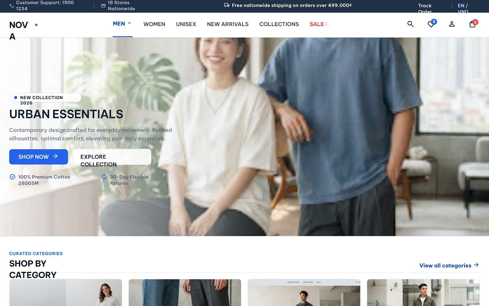
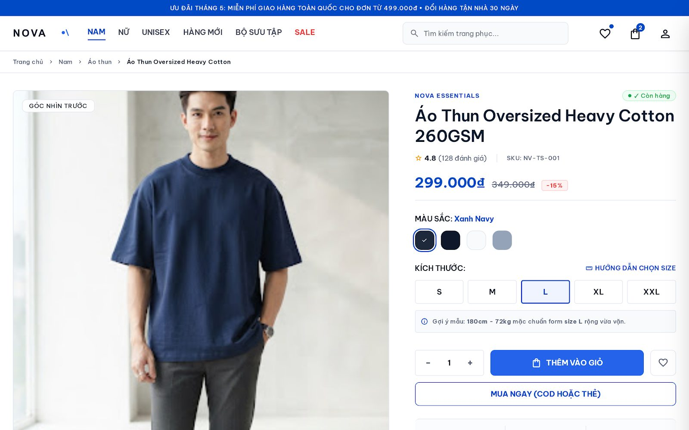
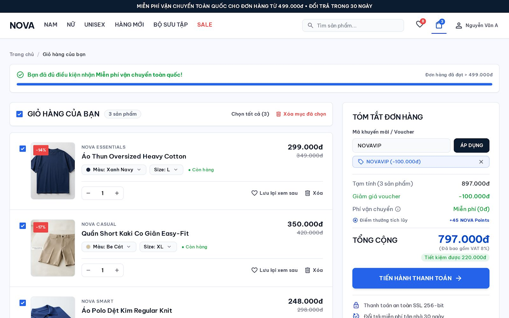

# Watch

Men's fashion storefront and admin. Monorepo: Laravel API (`apps/api`) and Next.js (`apps/web`).

Catalog, cart, checkout, VNPay, GHN shipping quotes, and Meilisearch. Demo data covers products, a customer, and a super admin.

## Screens

Storefront designs ([Stitch project](https://stitch.withgoogle.com/projects/3274922610422665241)): home, product, and cart.

| Home | Product | Cart |
|---|---|---|
|  |  |  |

## Stack

| | |
|---|---|
| Web | Next.js 16, React 19, TypeScript, Tailwind CSS, TanStack Query |
| API | Laravel 13, PHP 8.3, Sanctum (cookie SPA), Spatie Permission |
| Data | PostgreSQL 16, Redis 7, Meilisearch (Laravel Scout, queued) |
| Runtime | Docker Compose: `web`, `api`, `queue`, `postgres`, `redis`, `meilisearch` |

## What you can open

**Storefront** (`/`)

- Home, catalog, product page, search suggestions
- Cart and checkout, VNPay return
- Account: profile, addresses, orders, wishlist, reviews, notifications
- Guest order lookup

**Admin** (`/admin`)

- Dashboard
- Catalog: products, variants, brands, categories, attributes, reviews
- Inventory: warehouses, stock, movements
- Orders, shipments, payments, refunds
- Coupons, discounts, flash sales
- Customers, CMS pages and banners, settings, activity log
- Admin login with optional TOTP two-factor

OpenAPI UI (Scramble): [http://localhost:8000/docs/api](http://localhost:8000/docs/api)

## Prerequisites

- Docker and Docker Compose
- Make

## Quick start

```bash
cp .env.example .env
make build
make up
make migrate
make seed
```

`make seed` loads demo data and imports products, brands, and categories into Meilisearch. It only seeds when `APP_ENV` is `local` or `testing` (the example env is `local`).

Set `APP_KEY` in the root `.env` before logging in. The API entrypoint can generate a key, but that value lives only in the container process and changes on restart, which drops sessions.

```bash
make artisan CMD="key:generate --show"
```

Paste the `base64:...` line into root `.env` as `APP_KEY=...`, then restart:

```bash
make up
```

## URLs

| | |
|---|---|
| Storefront | http://localhost:3000 |
| Customer login | http://localhost:3000/login |
| Admin | http://localhost:3000/admin/login |
| API | http://localhost:8000 |
| API docs | http://localhost:8000/docs/api |
| Meilisearch | http://localhost:7700 |
| Postgres | `localhost:5432` (hostname inside Compose: `postgres`) |
| Redis | `localhost:6379` (hostname inside Compose: `redis`) |

## Demo accounts

Both passwords are `password`.

| | |
|---|---|
| Admin | `super_admin@example.com` |
| Customer | `customer@example.com` |

Use `localhost` for both the site and the API. Sanctum cookies, `CORS_ALLOWED_ORIGINS`, `SANCTUM_STATEFUL_DOMAINS`, and `SESSION_DOMAIN` in `.env.example` are set for that host.

## Payments and shipping

Checkout runs without live credentials. To exercise VNPay sandbox or GHN quotes, fill the `VNPAY_*` and `GHN_*` keys in the root `.env`. SMS uses the `log` driver unless `COMMERCE_SMS_DRIVER` is changed.

## Commands

```bash
make logs
make ps
make migrate
make seed
make test
make artisan CMD="route:list"
make shell-api
make shell-web
make down
```

Observability (Loki, Promtail, Prometheus, Grafana) is a separate Compose profile. Grafana is at http://localhost:3001 (`admin` / `admin`, local only).

```bash
docker compose --profile observability up -d
```

## Notes

- Root `.env` is the Compose env file. It is gitignored. Commit `.env.example` only.
- Inside Docker, Laravel uses `DB_HOST=postgres` and `REDIS_HOST=redis`.
- `apps/api` and `apps/web` are bind-mounted. `vendor` and `node_modules` stay in named volumes.
